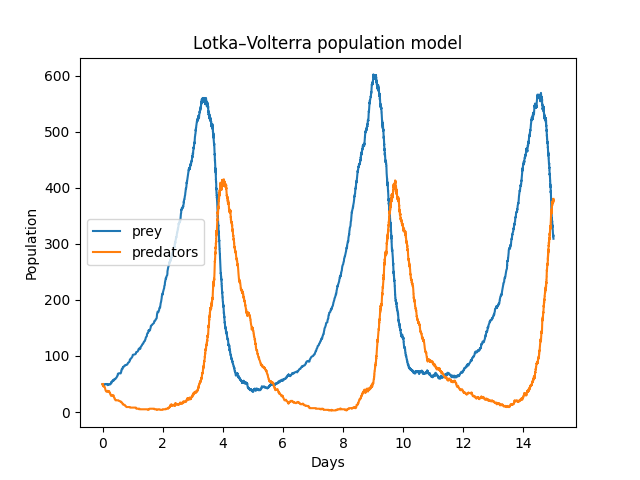

# Population simulations

Assuming that populations behave like molecules in an enclosed system we can model their evolution via the Gillespie
algorithm.

# Predator-prey (Lotka-Volterra)

We have two populations, predators `X` and prey `Y`. We assume that:

- Prey can get born on its own
- When a predator kills a prey, a new predator is born
- Predators can die on its own

Formulated as "chemical reactions":

```
Y     -> 2Y
X + Y -> 2X
X     -> 0
```


